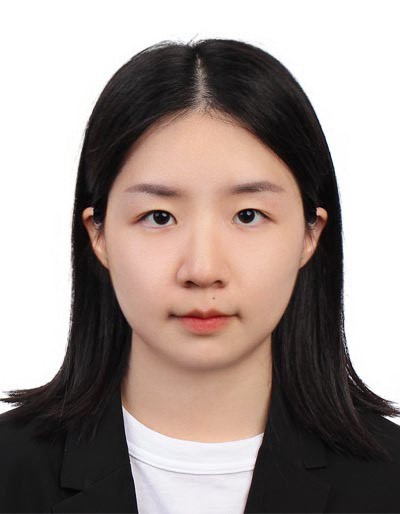

<!DOCTYPE html PUBLIC "-//W3C//DTD XHTML 1.1//EN"
  "http://www.w3.org/TR/xhtml11/DTD/xhtml11.dtd">
<html xmlns="http://www.w3.org/1999/xhtml" xml:lang="en">
<head>
<meta name="generator" content="jemdoc, see http://jemdoc.jaboc.net/" />
<meta http-equiv="Content-Type" content="text/html;charset=utf-8" />
<link rel="stylesheet" href="jemdoc.css" type="text/css" />
<link rel="shortcut icon" href="favicon.ico" />
<link rel="bookmark" href="favicon.ico" type="image/x-icon"　/>
<title>Cheng, Yi (程祎)</title>
</head>
<body>
<table summary="Table for page layout." id="tlayout">
<tr valign="top">
<td id="layout-menu">

Menu

<a href="index.html" class="current">Home</a>

<a href="https://scholar.google.com.sg/citations?user=OmyNx3IAAAAJ&hl=en">Google Scholar</a>

<a href="https://www.researchgate.net/profile/Yi-Cheng-26">ResearchGate</a>

</td>
<td id="layout-content">

<h1>Cheng, Yi (程祎) </h1>

<table class="imgtable"><tr><td>
&nbsp;</td>
<td align="left">
Senior Research Engineer, 
Institute for Infocomm Research, 
Agency for Science, Technology and Research (A*STAR)  
1 Fusionopolis Way, #21-01 Connexis, Singapore 138632  
E-mail: <a href="mailto:zhouxiuze@foxmail.com">Cheng_Yi@i2r.a-star.edu.sg</a>

</td></tr></table>
<h2>About me</h2>

I am currently a Senior Research Engineer with the Visual Intelligence Department, Institute for Infocomm Research (I2R), A*STAR, Singapore. I received the B.S. degree from the Wuhan University in 2016, and the M.S. degree from National University of Singapore, in 2018. My research interests include deep learning on computer vision, with an emphasis on video understanding and analysis, face recognition, and person reidentification.

<h2>Research Interests</h2>

Deep learning on computer vision, with an emphasis on video understanding and analysis, face recognition, and person reidentification. 

<h3>Recent publications </h3>
<ol>
<!-- <li>
Yi Cheng, Ying Sun, Hehe Fan, Tao Zhuo, Joo-Hwee Lim, Mohan Kankanhalli, "Entropy guided attention network for weakly-supervised action localization", <i>Pattern Recognition</i>, Jun. 2022, 195, pp. 116595. (IF = 6.954) [<a href="pub/CoCNN.pdf">pdf</a>][<a href="https://github.com/XiuzeZhou/cocnn">code</a>]

</li> -->
<li>
<strong>Entropy guided attention network for weakly-supervised action localization</strong>, Yi Cheng, Ying Sun, Hehe Fan, Tao Zhuo, Joo-Hwee Lim, Mohan Kankanhalli, <i>Pattern Recognition</i>, 2022. [<a href="pub/CoCNN.pdf">pdf</a>]

</li>
</li>
    
<strong>Deep Learning for Person Re-identification: A Survey and Outlook</strong>

    
<u>Mang Ye</u>, Jianbing Shen, Gaojie Lin, Tao Xiang, Ling Shao, Steven C. H. Hoi.

    
<i>IEEE Transactions on Pattern Analysis and Machine Intelligence (TPAMI), 2021.</i>
    

</li>
</ol>

<a href="https://scholar.google.com.sg/citations?user=OmyNx3IAAAAJ&hl=en">Full list of publications in Google Scholar</a>.

<h3>Academic service</h3>

<b>Reviewer</b>

<ul>
<li>
IEEE/CVF Computer Vision and Pattern Recognition Conference (CVPR)

</li>
<li>
European Conference on Computer Vision (ECCV)

</li>
<li>
IEEE International Conference on Image Processing (IEEE ICIP)

</li>  
</ul>
<h3>Competitions and awards</h3>
<ol>
<li>
The 1st Prize in the EPIC-Kitchens Dataset Challenges Unsupervised Domain Adaptation for Recognition Track in CVPR2021

</li>
<li>
The 2nd Prize in the EPIC-Kitchens Dataset Challenges Action Anticipation Track in CVPR2020

</li>
</ol>
<h2>Work experience</h2>
<ol>
<li>
Research Scientist, AI Research Institute, Hithink RoyalFlush, 06.2019-Present
</li>
<ul>
<li>
Research the newest machine learning algorithms and recommender system technology on stocks and hot news

</li>
<li>
Apply neural network models to drug-target interaction prediction and evaluate the performance

</li>
<li>
Publish papers and apply for relevant patents for the corporation

</li>
<li>
Give lessons on Artificial Intelligence and Recommender Systems to the staff

</li>
</ul>
<li>
Research Assistant, Big Data Lab, Xiamen University, 09.2016-02.2019
</li>
<ul>
<li>
Instructed two undergraduate and three graduate students in scientific research

</li>
<li>
Tracked, studied, reproduced, and improved up-to-date machine learning methods

</li>
<li>
Published papers on machine learning and recommender systems

</li>
</ul>
<li>
Software Engineer, Dragon SOFT, 07.2013-06.2014
</li>
<ul>
<li>
Developed an electronic target practice system for security guards’ shooting training

</li>
<li>
Recorded the track of users’ shooting behavior from sensors in a database

</li>
<li>
Built a model analyzing users&rsquo; shooting behavior concerning speed, acceleration and number of cylinders

</li>
</ul>
<li>
Assistant Engineer, Gold Electronic, 03.2012-07.2012
</li>
<ul>
<li>
Cooperated with motor companies, such as Zotye and BYD, on battery management system development

</li>
<li>
Developed a testing and analytics platform for performance of a lithium battery with C# (real-time data)

</li>
<li>
Used CAN bus to collect working data of batteries and analyzed the data for balance power

</li>
</ul>
</ol>

 
<a href="cv/cv.pdf">A brief cv</a>.

</td>
</tr>
</table>
</body>
</html>
